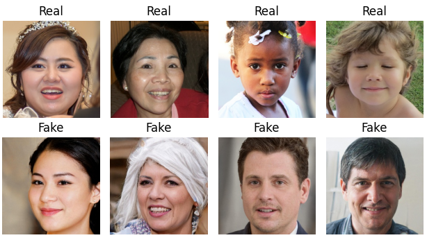

# DeepFake Detection in Face Images- Final Project Computer Vision (Fall 2023)

**Objective:**
Use Convolutional Neural Networks to detect deepfakes in Face Images



## Create Virtual Environment 
The following commands can be used to create the conda environment and install all necessary dependencies:
```bash
python -m venv df_venv
pip install -r requirements.txt
```

## Notes

This project was part of the coursework for the Computer Vision (Fall 2023) course at NYU.
Contributors:
* Anoushka Gupta (ag8733@nyu.edu)
* Arunima Mitra (am13018@nyu.edu)
* Divyanshi Parashar (dp3635@nyu.edu)
